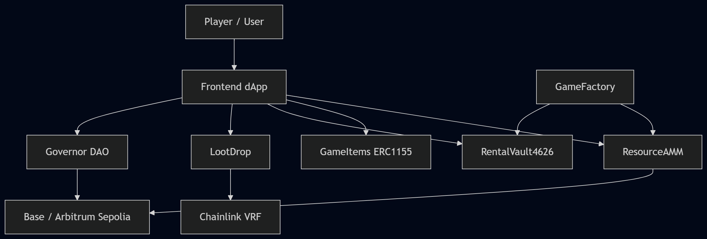
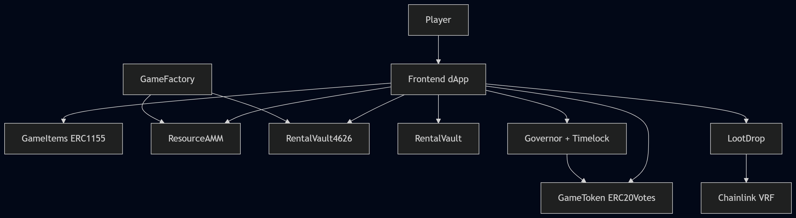
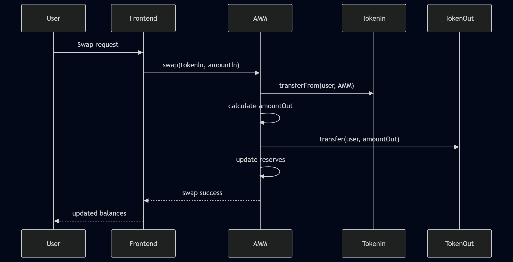
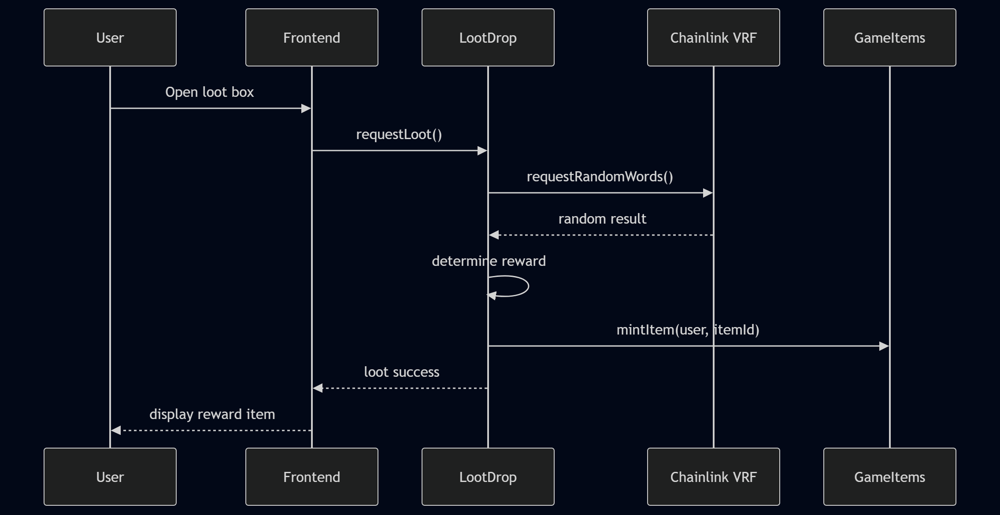
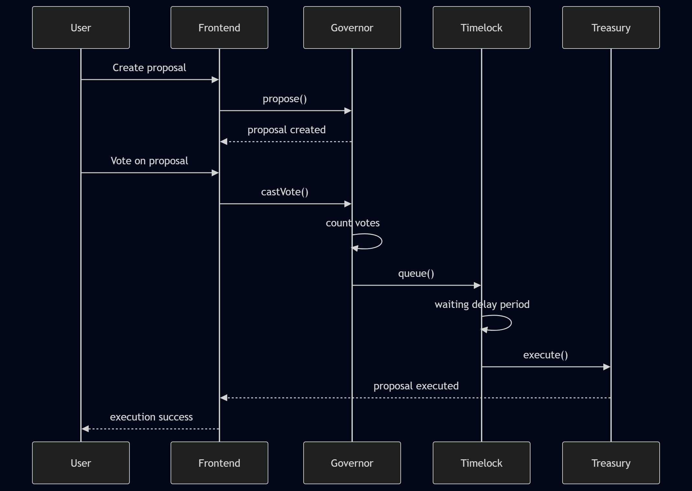

# GameFi Economy Protocol Architecture

## Project Overview

This project is a GameFi economy protocol developed for the Blockchain Technologies 2 final project.

The protocol combines:
- ERC20 governance/resource token
- ERC1155 in-game item economy
- Constant-product AMM marketplace
- ERC4626 tokenized vault
- NFT rental vault
- Loot drop mechanics
- DAO governance
- Layer 2 deployment

---

## Core Contracts

### GameToken.sol
ERC20 governance token with ERC20Votes and ERC20Permit extensions.

### GameItems.sol
ERC1155 contract used for in-game items and inventory management.

### ResourceAMM.sol
Constant-product AMM for swapping fungible game resources.

### RentalVault.sol
NFT rental vault for temporary item lending.

### RentalVault4626.sol
ERC4626 tokenized vault implementation.

### LootDrop.sol
Loot drop contract integrated with randomness mechanics.

### GameFactory.sol
Factory contract for deploying protocol components.

### YulHelper.sol
Yul assembly optimization helper contract.

---

## Design Patterns

### 1. Factory Pattern

The protocol uses the Factory pattern through `GameFactory.sol`.

Purpose:
- deploy modular protocol components
- simplify contract creation
- support scalable architecture

Benefits:
- reusable deployment logic
- improved modularity
- easier future expansion

---

### 2. Access Control Pattern

The protocol uses OpenZeppelin `Ownable` access control.

Used in:
- GameToken.sol
- GameItems.sol
- administrative functions

Purpose:
- restrict privileged operations
- protect minting and item creation
- secure protocol administration

---

### 3. Checks-Effects-Interactions (CEI)

The protocol follows the CEI security pattern in liquidity and transfer operations.

Purpose:
- reduce reentrancy risks
- ensure safe state updates before external calls

Benefits:
- safer token transfer flow
- improved smart contract security

---

### 4. Pull-over-Push Pattern

The protocol uses pull-based withdrawal logic in liquidity removal and vault interactions.

Purpose:
- allow users to withdraw funds themselves
- reduce failed transfer risks

Benefits:
- safer asset withdrawals
- improved reliability

---

### 5. Upgradeable Proxy Pattern (UUPS)

The protocol plans to support upgradeable contracts using the UUPS proxy architecture.

Purpose:
- allow future protocol upgrades
- support bug fixes and feature expansion

Benefits:
- upgrade flexibility
- long-term maintainability

---

## System Context Diagram

---

## Container Diagram

---

## Swap Sequence Diagram

---

## Loot Drop Sequence Diagram

---

## Governance Voting Sequence Diagram

---

## Upgrade Path (V1 → V2)

The protocol plans to support upgradeable contracts using the UUPS proxy architecture.

### Selected Upgradeable Contract

`RentalVault4626.sol`

### Motivation for Upgradeability

The vault contract is expected to evolve over time due to:
- additional reward mechanisms
- improved yield strategies
- security improvements
- governance-controlled parameter updates

### Upgrade Flow

1. Deploy Vault V1 implementation
2. Deploy UUPS proxy pointing to V1
3. Store user balances and vault state inside the proxy storage
4. Develop Vault V2 implementation
5. Governance approves upgrade proposal
6. Timelock executes upgrade transaction
7. Proxy points to the new V2 implementation

### Benefits

- preserves storage and user balances
- allows future protocol improvements
- enables post-deployment bug fixes
- improves long-term maintainability